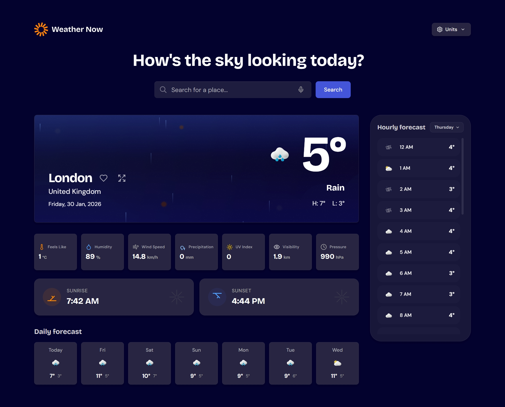
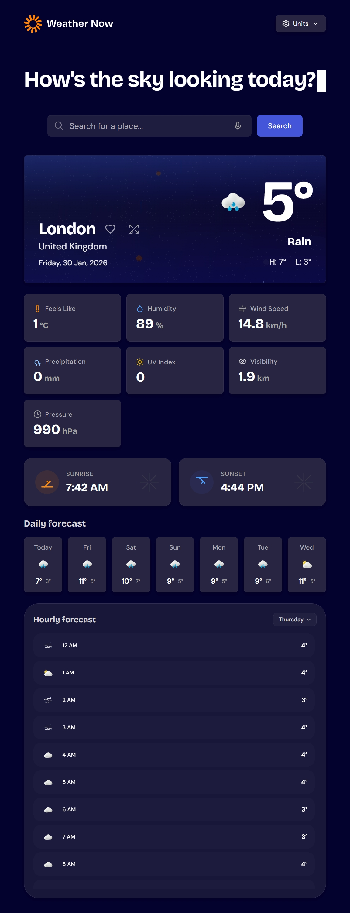
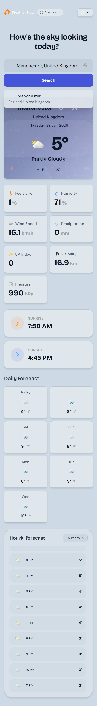

# Frontend Mentor - SkyCast Weather App Solution

This is a solution to the [Weather App challenge on Frontend Mentor](https://www.frontendmentor.io/challenges/weather-app-SlVAb76Y_). Frontend Mentor challenges help you improve your coding skills by building realistic projects.

## Table of contents

- [Overview](#overview)
  - [The challenge](#the-challenge)
  - [Screenshot](#screenshot)
  - [Links](#links)
- [My process](#my-process)
  - [Built with](#built-with)
  - [What I learned](#what-i-learned)
  - [Continued development](#continued-development)
  - [Useful resources](#useful-resources)
- [Features](#features)
- [Features in Detail](#features-in-detail)
- [Getting Started](#getting-started)
- [Usage](#usage)
- [Project Structure](#project-structure)
- [Author](#author)
- [Acknowledgments](#acknowledgments)

## Overview

SkyCast is a modern, feature-rich weather dashboard built with React 19 and Tailwind CSS 4. It provides real-time weather data, 7-day forecasts, and immersive animated backgrounds that adapt to current conditions and the time of day.

### The challenge

Users should be able to:

- Search for weather information by entering a location in the search bar.
- Use **Voice Search** to find locations hands-free.
- View current weather conditions including temperature, weather icon, and location details.
- See additional weather metrics like **UV Index**, **Visibility**, **Pressure**, and **Sunrise/Sunset** times.
- Browse a 7-day weather forecast and a detailed hourly forecast.
- **Compare Locations**: View weather side-by-side for up to 4 different places.
- **Favorites System**: Bookmark frequently checked locations for quick access.
- **Automated Themes**: The app switches between Light and Dark modes based on the user's local time.
- **PWA Support**: Install the app on mobile or desktop for a native-like experience and offline access.

### Screenshot





### Links

- Solution URL: [Add solution URL here](https://your-solution-url.com)
- Live Site URL: [Add live site URL here](https://your-live-site-url.com)

---

## My process

### 1. Planning & Design
- Analyzed the Frontend Mentor designs and expanded them with advanced features like Comparison Mode and Favorites.
- Designed a custom HSL-based theme system to handle daylight (Muted Light) and nighttime (Immersive Dark) transitions.

### 2. Core Implementation
- Used **Vite 6** for a blazing-fast development environment.
- Integrated **Open-Meteo API** for weather data and **Nominatim (OpenStreetMap)** for reverse geocoding.
- Built a custom particle and gradient system for animated weather backgrounds.

### 3. Advanced Features
- Implemented **Voice Search** using the Web Speech API.
- Developed a **Comparison Mode** allowing side-by-side weather analysis for multiple cities.
- Added **PWA** capabilities using `vite-plugin-pwa` for mobile installation and offline caching.

### 4. Accessibility & UX
- Ensured a mobile-first, responsive layout that remains functional on screens as small as 320px.
- Fine-tuned light mode contrast to reduce eye strain while maintaining a sophisticated look.
- Added keyboard-accessible search and comparison toggles.

### Built with

- **React 19** – Modern UI and state management
- **Vite 6** – Next-generation build tool
- **Tailwind CSS 4** – Utility-first CSS framework with dynamic theme variables
- **Open-Meteo API** – Real-time weather data
- **Nominatim API** – Geocoding and reverse geocoding
- **Web Speech API** – Integrated voice recognition
- **vite-plugin-pwa** – Progressive Web App capabilities

### What I learned

I gained deep experience in managing complex asynchronous state (fetching multiple locations simultaneously for comparison) and implementing time-based automated UI transitions. I also mastered CSS-based particle systems for the weather animations, ensuring they remain high-performance even on mobile devices.

### Continued development

Future updates will include detailed precipitation maps, air quality indices, and a more robust notification system for severe weather alerts.

## Features

| Feature | Details |
|---|---|
| **Animated Backgrounds** | High-fidelity CSS/SVG animations for Sunny, Cloudy, Rain, Snow, and Storm conditions |
| **Location Comparison** | Compare weather side-by-side for up to 4 saved locations |
| **Voice Search** | Hands-free location searching using integrated speech recognition |
| **Adaptive Theme** | Auto-switching Light/Dark modes based on the user's time of day |
| **Geolocation** | Automatic weather detection for the user's current city on first visit |
| **PWA Installed** | Installable as a standalone app on iOS, Android, and Desktop |

## Features in Detail

- **Animated Backgrounds:** Immersive particle systems (raindrops, snowflakes, sunbeams) and layered mists that adapt to both the weather and the active theme.
- **Comparison Mode:** Fetching weather data in parallel for multiple locations, displayed in a clean, scrollable grid.
- **Voice Search:** Real-time feedback with a pulsing recording state, converting speech to text for instant location lookup.
- **Metrics Dashboard:** Detailed insights including UV Index, Visibility, Surface Pressure, and formatted Sunrise/Sunset times.

## Getting Started

1. Clone the repository
   ```bash
   git clone https://github.com/yourusername/weather-app.git
   cd weather-app
   ```

2. Install dependencies
   ```bash
   npm install --legacy-peer-deps
   ```

3. Start development server
   ```bash
   npm run dev
   ```

4. Open your browser to `http://localhost:5173`

## Project Structure

```
weather-app/
├── src/
│   ├── assets/        # Custom fonts and static images
│   ├── components/    # Reusable UI components (AnimatedBG, Search, etc.)
│   ├── services/      # API logic (Open-Meteo, Nominatim)
│   ├── types/         # TypeScript interfaces
│   ├── utils/         # Weather mapping and helper functions
│   ├── App.tsx        # Root layout and theme logic
│   └── main.tsx       # Entry point and PWA registration
├── public/            # PWA icons and static assets
├── index.html         # HTML entry with PWA metadata
└── vite.config.ts     # Vite and PWA plugin configuration
```

## Author

- Frontend Mentor - [@MhistaFortune](https://www.frontendmentor.io/profile/MhistaFortune)
- Twitter/X - [@fortunate_egwu](https://www.twitter.com/fortunate_egwu)

## Acknowledgments

- [Frontend Mentor](https://www.frontendmentor.io) for the project concept.
- [Open-Meteo](https://open-meteo.com/) for their excellent, free weather API.
- [OpenStreetMap](https://www.openstreetmap.org/) for the Nominatim geocoding service.

